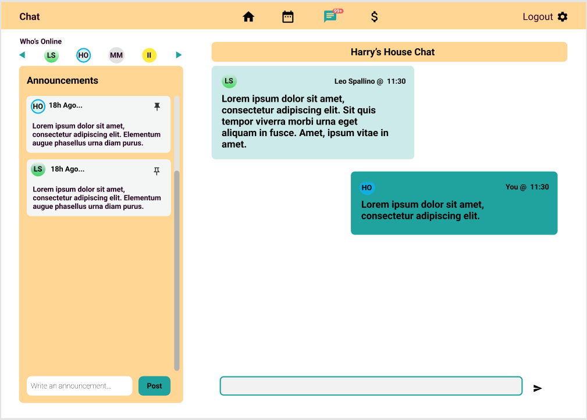

# Open-source Challenge 1

## Task

> ### Build a group chat page with React using Material UI as a components library. Your backend services are to be built using Express.js and Socket.io or native Websocket.Please take into consideration the following guidlines:

- ### The frontend **MUST** use functional components and React hooks
- ### The backend API requests ** MUST** be built in express.js in Node
- ### We will leave the database type and design up to you. We would prefer a widely adopted database such as PostgreSQL, MongoDB, MySQL, or even Redis.
- ### Please develop your application using the provided folder structure
- ### Consider the design provided in the image below while designing the chat component. REMEMBER, you do not need to build any of the other components on the screen, only the chat component.

---

## First Steps DO NOT SKIP

1. Fork the repository (https://github.com/DSC-McMaster-U/uniserver)
2. Read this article if unfamiliar with how to fork and open a pull request: https://opensource.com/article/19/7/create-pull-request-github
3. Clone the forked repository on your computer.
4. Develop your application submission and follow the submission steps below when finished.

---

## How to Submit

1. Add instructions on how to run your application in the empty How-to-Run.md file provided in the chat folder.
2. Push your final changes to the forked repository. If you havent forked the repository, you will not be able to commit code directly.
3. Open a pull request as outlined in the artical above
4. Make a formal submission via the following google form: https://forms.gle/1Cw8twtg8hd8kAdVA

---

## Wireframe

---

## Helpful Links

| **Topic**                                          | **Link**                                                                                                                                                                                                        |
| -------------------------------------------------- | --------------------------------------------------------------------------------------------------------------------------------------------------------------------------------------------------------------- |
| Discord Event Server                               | _https://discord.gg/dJvDHTND_                                                                                                                                                                                   |
| How to build a group chat with React and Socket.io | _1.https://medium.com/swlh/build-a-real-time-chat-app-with-react-hooks-and-socket-io-4859c9afecb0  2.https://dev.to/divofred/how-to-build-a-realtime-group-chat-application-with-react-and-socketio-2jf0_ |
| Socket.io                                          | _https://socket.io/get-started/_                                                                                                                                                                                |
| Express.js                                         | _https://expressjs.com/_                                                                                                                                                                                        |
| React Hooks                                        | _https://reactjs.org/docs/hooks-intro.html_                                                                                                                                                                     |
| Material UI                                        | _https://mui.com/getting-started/usage/_                                                                                                                                                                        |
